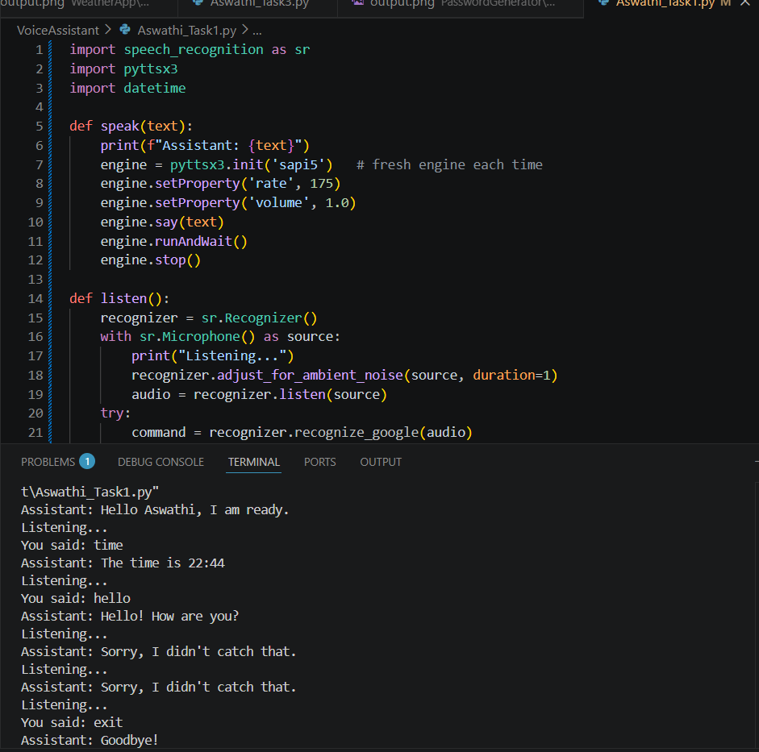
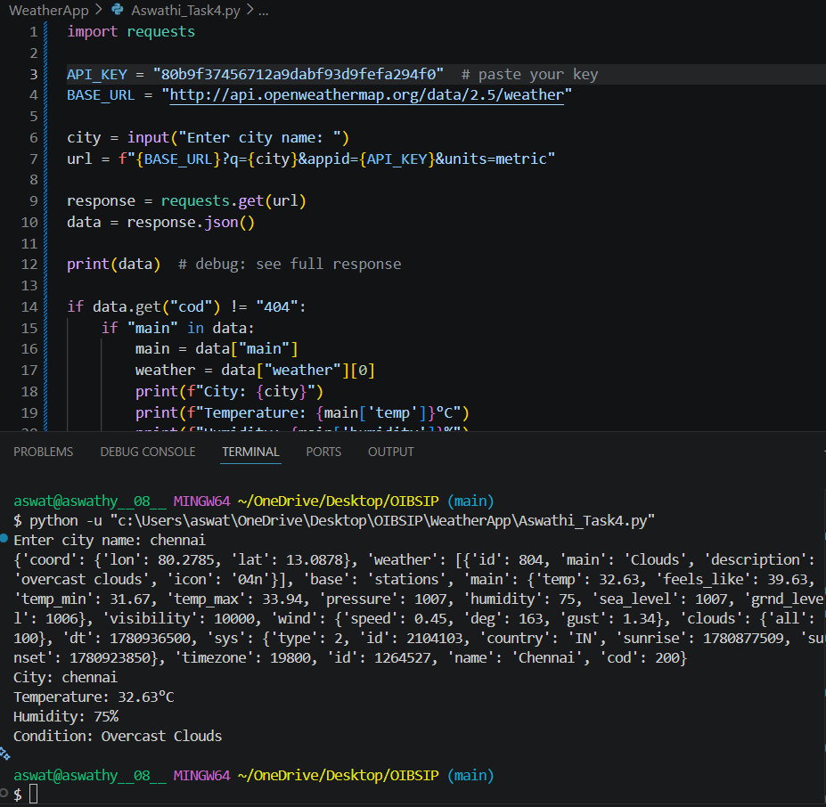
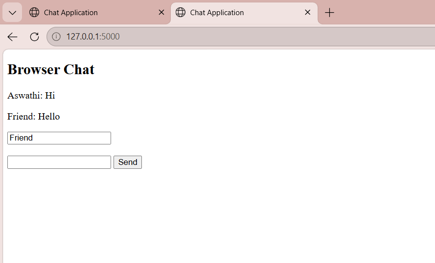
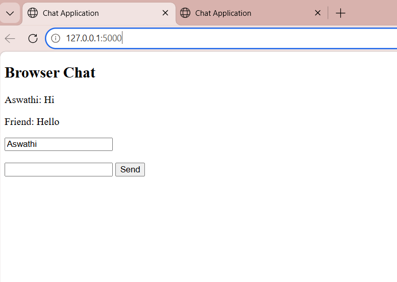

# OIBSIP Internship Projects
**Author:** Aswathi S  
**Internship:** Oasis Infobyte  
**Duration:** june 2026 – July 2026  
**GitHub Repository:** [Click Here](https://github.com/aswathy08/OIBSIP)  
**Demo Video:** [Watch Here](https://drive.google.com/file/d/14g_47T_hsfZBMlY7u-sIhTN3MDY3r5kp/view?usp=sharing)  


----

## 🧑‍💻 Task 1 – Voice Assistant
### Purpose
A simple voice assistant that responds to user commands.

**Screenshot:**  
  

### Features
- Speech recognition and text‑to‑speech  
- Executes basic commands (say hello, tell time, etc.)  
- Runs in **Python 3.11**


## 🧑‍💻 Task 2 – BMI Calculator

### Console Version
- **File:** [text](OIBSIP_PythonProgramming_Task2)/Aswathi_Task2.py  
- **Input:** Weight (kg), Height (cm)  
- **Output:** BMI value and category  

**Screenshot:**  
  

---

### GUI Version
- **File:** [text](OIBSIP_PythonProgramming_Task2)/Aswathi_Task2_GUI.py  
- **Features:**  
  - User‑friendly interface  
  - Color‑coded results  
  - Reset button  

**Screenshot:**  
  


##👨‍💻 Task 3 - Password Generator

### Console Version
- File: [text](OIBSIP_PythonProgramming_Task3)/Aswathi_Task3.py  
- Input: Password length, choices for uppercase/lowercase/digits/symbols  
- Output: Generated password and strength category  

**Screenshot:**  


---

### Features
- User chooses password length  
- Options to include uppercase, lowercase, digits, and symbols  
- Guarantees at least one character from each chosen type  
- Strength meter (Weak / Medium / Strong)  


## 🧑‍💻 Task 4 – Weather App

### Console Version
- **File:** [text](OIBSIP_PythonProgramming_Task4)/Aswathi_Task4.py  
- **Input:** City name  
- **Output:** Real‑time weather details (temperature, humidity, condition)  

**Screenshot:**  
  

---

### Features
- Fetches live weather data using **OpenWeatherMap API**  
- Displays temperature, humidity, and weather condition  
- Error handling for invalid city names  

---

### Note
The internship guidelines suggested implementing the Weather App in **JavaScript**.  
However, this version is implemented in **Python (3.14)** using the `requests` library for API calls.  
This demonstrates applied Python programming and API integration skills, which are equally valid for the internship.


## 🧑‍💻 Task 5 – Browser‑Based Chat Application

## 📌 Overview
This task demonstrates a **browser‑based chat application** built with **Flask** and **SocketIO**.  
It enables real‑time communication between multiple users through a web interface, showcasing integration of Python backend with HTML/JavaScript frontend.

---

**Screenshot:**  
  
  

---

## 🧑‍💻 Features
- Web‑based chat interface (runs in browser)  
- Real‑time communication using **WebSockets**  
- Built with **Flask (Python backend)** and **SocketIO**  
- Simple, beginner‑friendly UI with message broadcasting  
- Multiple clients can join via browser tabs/windows  

---

## ⚙️ Requirements
- Python **3.14** installed  
- Dependencies:
  ```bash
  pip install flask flask-socketio

### How to Run
```bash 
  py -3.14 OIBSIP_PythonProgramming_Task5/Aswathi_Task5.py
  [http://localhost:5000](http://localhost:5000)


