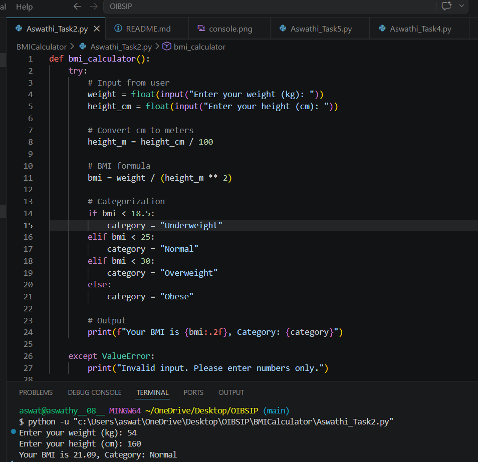
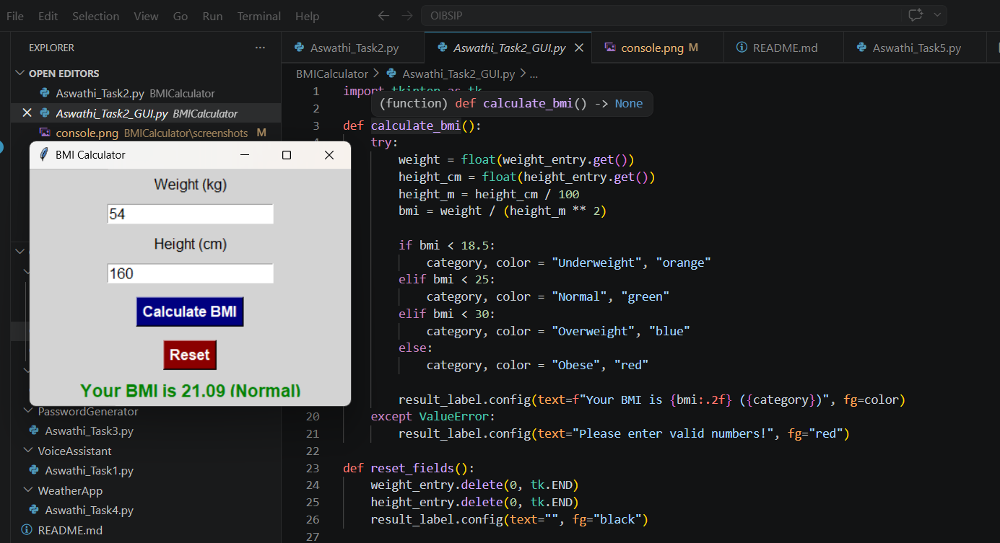
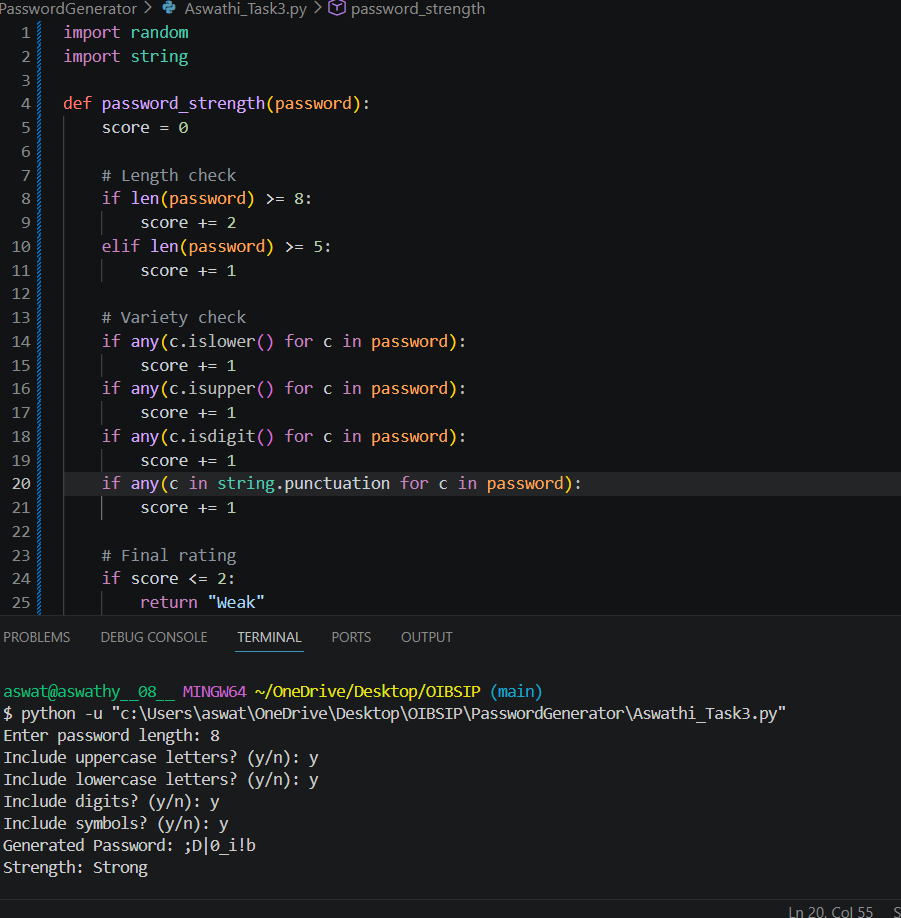

# OIBSIP Internship Projects

## Task 2 - BMI Calculator

### Console Version
- File: BMICalculator/Aswathi_Task2.py  
- Input: Weight (kg), Height (cm)  
- Output: BMI value and category  

### Console Version


### GUI Version
- File: BMICalculator/Aswathi_Task2_GUI.py  
- Features:
  - User-friendly interface  
  - Color-coded results  
  - Reset button 

### GUI Version



## Task 3 - Password Generator

### Purpose
Generates secure random passwords based on user preferences.

### Features
- User chooses password length
- Options to include uppercase, lowercase, digits, and symbols
- Guarantees at least one character from each chosen type
- Strength meter (Weak / Medium / Strong)

### How to Run
Open your terminal/command prompt and type:
```bash
python Aswathi_Task3.py
**Screenshot:**  

